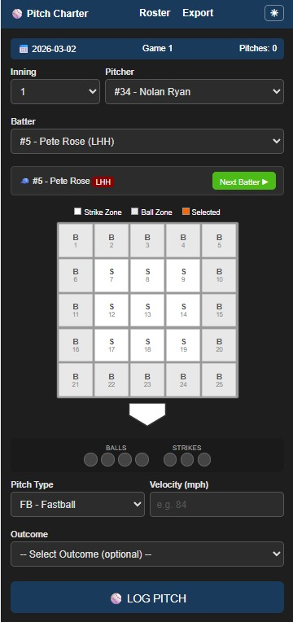

# Pitch Charter

A baseball pitch tracking and charting web application built with React. Designed for coaches and scorekeepers to log pitches in real time, monitor ball/strike counts, and export game data for analysis.



## Features

- **Game Setup** — Start a session by entering the game date and game number (1, 2, or 3)
- **Interactive Strike Zone** — Click a 5×5 zone grid to log pitch location; zones automatically classify as strike or ball
- **Pitch Logging** — Record pitcher, batter, pitch type (FB/CV/SL/CH), velocity, zone, and outcome per pitch
- **Live Count Tracking** — Visual ball and strike counters update with each logged pitch
- **Batter Management** — Select existing batters or add new ones on the fly during a game
- **Roster Management** — Add, edit, and delete pitchers with jersey numbers; data persists across sessions
- **Undo** — Remove the last logged pitch if needed
- **Export to CSV** — Download all pitch data as a CSV file formatted for Excel analysis
- **Game Summary** — View pitch, strike, and ball totals broken down by pitcher and inning
- **Dark Mode** — Toggle between light and dark themes; preference is saved across sessions
- **AWS Backend** — Pitches are synced to an AWS Lambda/API Gateway endpoint for cloud persistence

## Tech Stack

- [React 19](https://react.dev/) with [React Router 7](https://reactrouter.com/)
- Create React App (build tooling)
- AWS API Gateway + Lambda (backend)
- `localStorage` for offline-first state persistence

## Project Structure

```
src/
├── pages/
│   ├── GameSetupPage.js   # Game date/number entry and session start
│   ├── ChartingPage.js    # Main pitch logging interface
│   ├── RosterPage.js      # Pitcher roster CRUD
│   └── ExportPage.js      # CSV export and game summary stats
├── components/
│   └── StrikeZone.js      # Interactive 5×5 zone grid component
├── context/
│   └── DarkModeContext.js # Dark mode state and toggle
├── App.js                 # Router and nav layout
└── index.js               # App entry point
```

## Getting Started

### Prerequisites

- Node.js 16+ and npm

### Installation

```bash
git clone https://github.com/your-username/pitch-charter.git
cd pitch-charter
npm install
```

### Running Locally

```bash
npm start
```

Opens at [http://localhost:3000](http://localhost:3000).

### Building for Production

```bash
npm run build
```

Output is placed in the `build/` folder.

## Usage

1. **Roster** — Navigate to the Roster page and add your pitchers with jersey numbers before the game.
2. **Game Setup** — On the home page, enter the game date and game number, then click **Start Charting**.
3. **Charting** — Select the inning, pitcher, and batter. Click a zone on the strike zone grid, choose the pitch type, enter velocity, select the outcome, and click **Log Pitch**.
4. **Export** — Navigate to the Export page to view game summary stats and download a CSV of all pitches.

## CSV Export Columns

| Column | Description |
|---|---|
| `pitchNumber` | Sequential pitch number for the game |
| `gameDate` | Date of the game |
| `gameNumber` | Game number (1, 2, or 3) |
| `gameId` | Combined ID: `{gameDate}-G{gameNumber}` |
| `inning` | Inning number |
| `pitcherNumber` | Pitcher jersey number |
| `pitcherName` | Pitcher name |
| `batterNumber` | Batter jersey number |
| `batterName` | Batter name |
| `batterHand` | Batter handedness |
| `pitchType` | FB, CV, SL, or CH |
| `velocity` | Pitch speed (MPH) |
| `zone` | Zone number (1–25) |
| `result` | Strike or Ball |
| `outcome` | Hit, Strikeout, Walk, HBP, Foul, etc. |

## License

MIT
